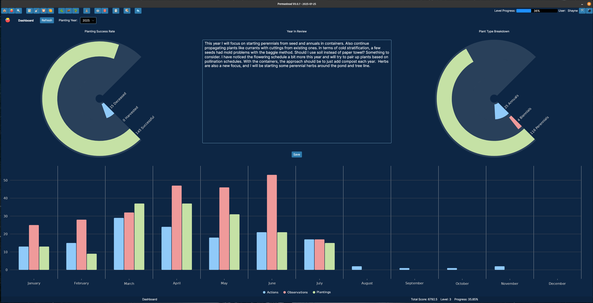
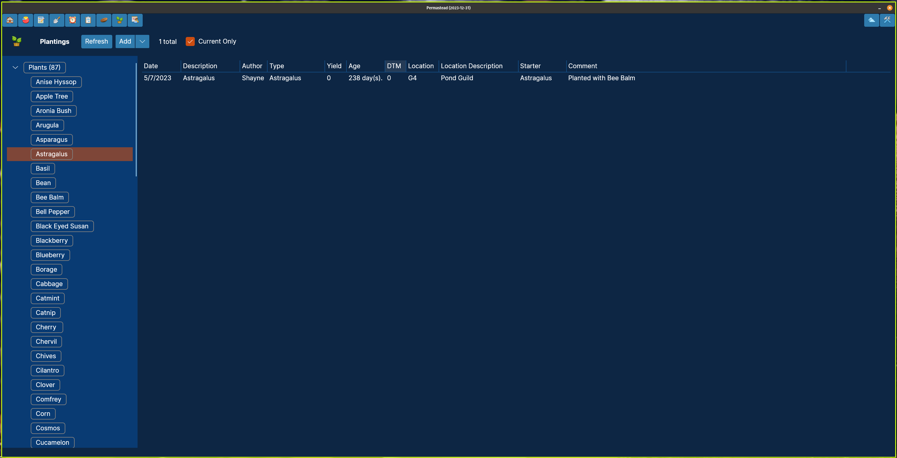

# Permastead
Local-first desktop software for managing a homestead using permaculture design. It features observations, actions, events and inventory as well as the ability to track your plantings and seed saving over time. WARNING: this is beta software and may have breaking changes yet to come. For a more detailed introduction to the application, check out the [wiki](https://github.com/curvedspace/Permastead/wiki).

Latest Release - [v0.3.0](https://github.com/curvedspace/Permastead/releases/tag/v0.3.0-beta)

- Observations - these allow you to journal your observations on your property over time.
- Actions - this is essentially a TODO list that helps keep track of what needs to be done.
- Events - events are cyclical and can either be informational, or trigger TODOs in your Actions view.
- Procedures - stores documentation on procedures for the homestead, various chores, equipment maintenance, recipes, etc.
- Inventory - this tracks what you have available on the homestead and where it is located
- People - a list of contacts and their info.
- Plants - a plant database
- Starters view - this shows your current seed inventory and other plant starts like root cuttings or saplings.
- Plantings View - this show your plantings, both current and historical.
- Animals - tracks your pets and/or livestock
- Harvests - tracks your harvests over time
- Preservation - this tracks the food you have preserved by freezing, fermenting, etc.

Home View

Dashboard View

Starters View

Plantings View

Thanks
- dan0v from Amplitude Soundboard for the publishing code
- wttr.in weather service
- Nikita Shishkin for weather project
- Beto Rodriguez for LiveCharts2
- IRIHI Technology for Ursa
- The entire Avalonia team
